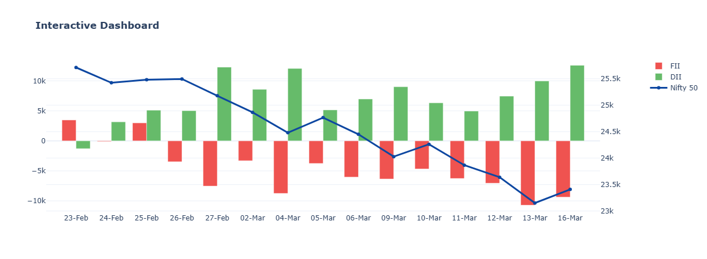

# 📊 NSE Market Intelligence Suite
**Automated Institutional Flow (FII/DII) Tracker & Predictive Bounce Model**

## 🎯 Project Overview
 This project is an end-to-end data pipeline and machine learning model designed to track "Smart Money" in the Indian Stock Market (NSE). It automatically ingests daily Foreign and Domestic Institutional cash flows, calculates statistical volatility, and uses a Random Forest classifier to predict high-probability short-covering bounces during market panics. 

This project demonstrates my ability to handle dirty financial data, build interactive dashboards, and deploy predictive analytics.

## 🛠️ Tech Stack & Skills Demonstrated
* **Data Engineering (Pandas/NumPy):** Built an automated ETL pipeline to clean messy CSV data, handle missing values (`NaN`), and merge disparate datasets (FII flows vs. Nifty 50 pricing).
* **Statistical Analysis:** Engineered custom features, including a rolling Z-Score "Volatility Meter," to identify extreme (3-sigma) market sell-offs.
* **Data Visualization (Plotly):** Developed a fully interactive, dark-mode web dashboard featuring precise buy/sell markers to visualize the AI's predictions.
* **Machine Learning (Scikit-Learn):** Trained a `RandomForestClassifier` to predict future 5-day market returns based on institutional panic signals, fully validated with rigorous Data Leakage checks.

## 🚀 How It Works (The Pipeline)
1. **Extract:** Ingests raw `.csv` files containing daily FII/DII cash market activity and Nifty 50 closing prices.
2. **Transform:** Cleans the data, formats timestamps, and calculates a dynamic Z-Score to isolate days with extreme institutional selling.
3. **Predict:** Feeds the formatted data into the ML model to predict whether the market will continue to crash or successfully bounce (Target = 1).
4. **Visualize:** Outputs an interactive `.html` web dashboard highlighting the historical success rate of the predictions.

## 📂 Repository Structure
```text
├── data/
│   ├── ai_trading_dashboard.html    <-- Interactive Web Dashboard (Final Output)
│   ├── final_ai_trading_signals.csv <-- Master database with AI predictions
│   ├── nifty50.csv                  <-- Raw index closing prices
│   ├── fii_history_2026-02.csv      
│   ├── fii_raw_jan_2026.csv         
│   └── fii_raw_mar_2026.csv         
├── notebooks/
│   └── 03_fii_dii_master.ipynb      <-- Primary Engine (ETL, ML, Visuals, Logic)
├── dark_chart.png                   <-- Static Hero Image for GitHub rendering
└── README.md